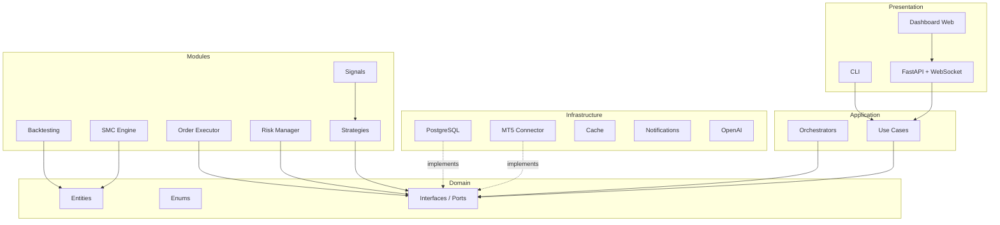
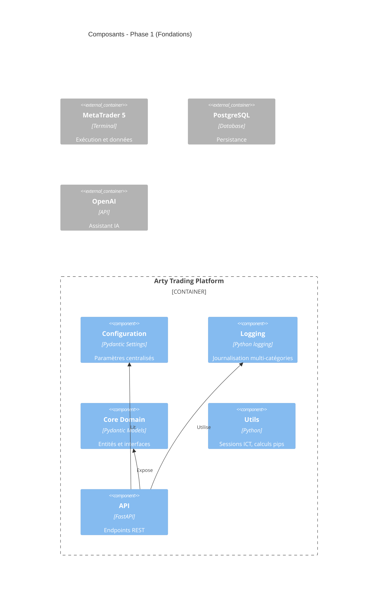
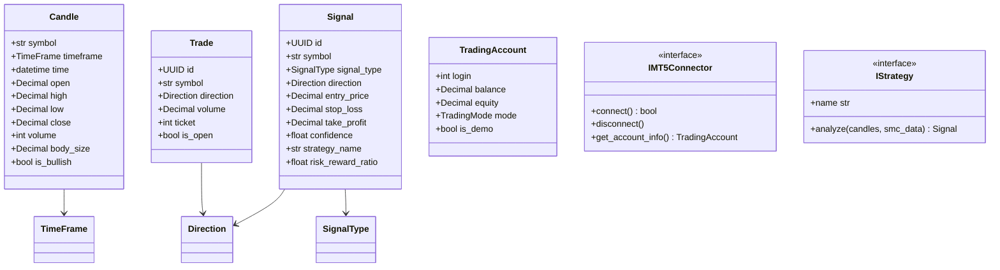
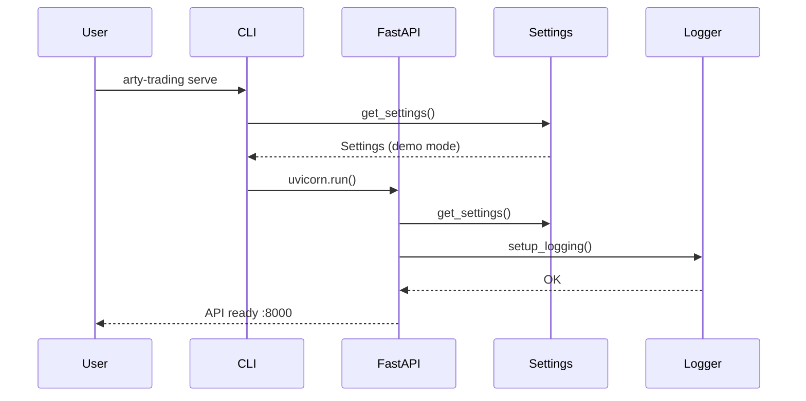
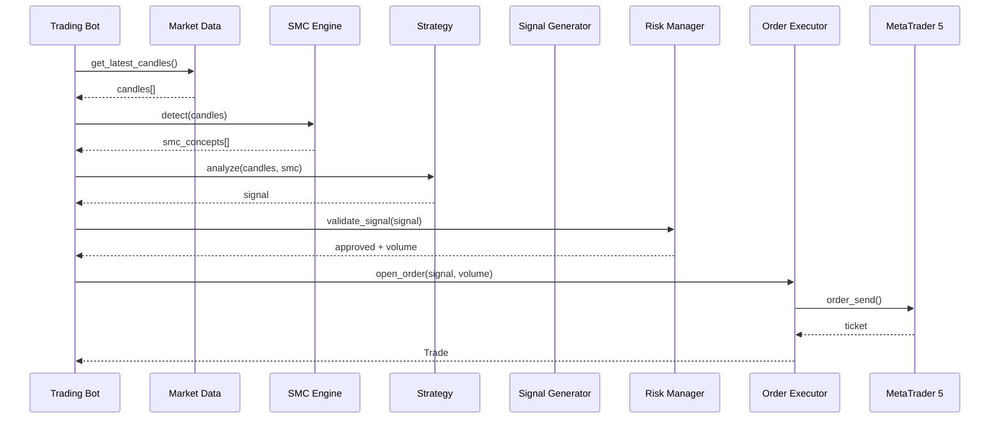

# Architecture Arty Trading Platform

## Vue d'ensemble

La plateforme suit une **Clean Architecture** en couches concentriques, où les dépendances pointent toujours vers l'intérieur (vers le domaine).

## Diagramme de composants

## Diagramme de classes (Core Domain)

## Diagramme de séquence - Démarrage API

## Diagramme de séquence - Flux de trading (cible)

## Modules et responsabilités

| Module | Package | Responsabilité |
|--------|---------|----------------|
| Configuration | `config/` | Settings Pydantic, .env |
| Core | `core/` | Entités, enums, interfaces |
| Logging | `logging/` | Logs console/fichier |
| Utils | `utils/` | Sessions, pips, helpers |
| Infrastructure | `infrastructure/` | MT5, DB, cache (Phase 2+) |
| Modules | `modules/` | SMC, stratégies, signaux (Phase 4+) |
| Application | `application/` | Use cases (Phase 2+) |
| API | `api/` | FastAPI REST/WebSocket |

## Principes de design

1. **Indépendance des modules** : chaque détecteur SMC, stratégie et service est activable/désactivable
2. **Sécurité par défaut** : mode DEMO, `ALLOW_LIVE_TRADING=false`
3. **Ports & Adapters** : interfaces dans `core/`, implémentations dans `infrastructure/`
4. **Configuration externalisée** : tout paramètre via `.env`
5. **Testabilité** : injection de dépendances via interfaces ABC
